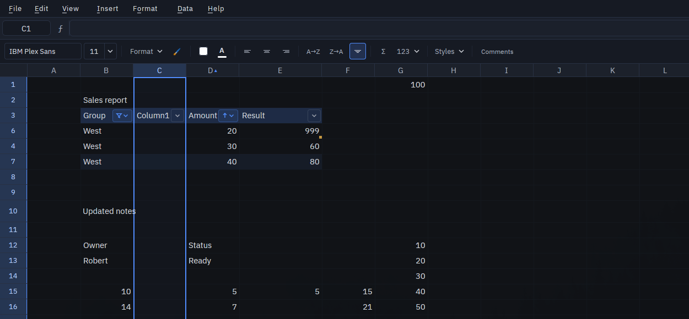
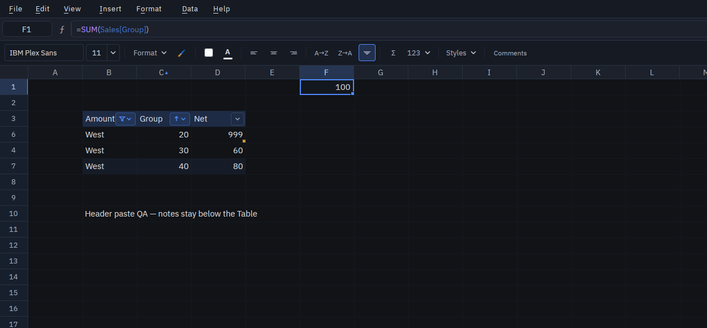
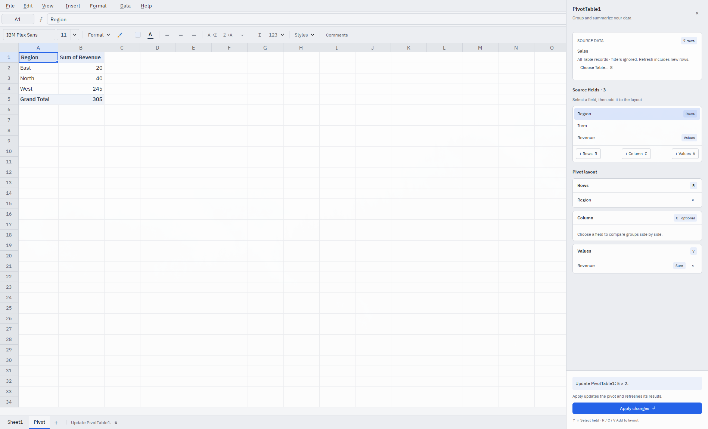
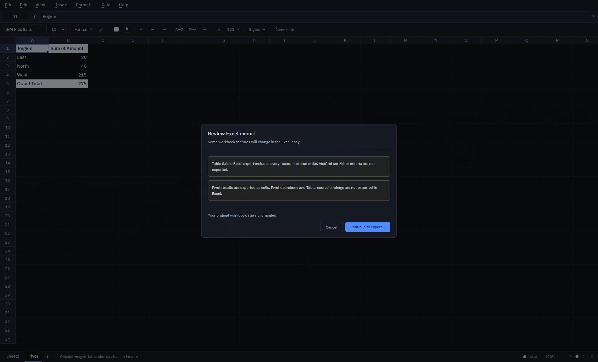

# Tables: engine, structured references, desktop authoring, row growth, and calculated columns

Status: Phase 1 desktop authoring, row growth, calculated columns and release hardening are implemented. Phase 2 has persisted Table views, desktop header dropdowns, sparse cell history, and atomic editing, pasting, filling and cutting through visible Table records, 2026-10-01. The product plan lives in the Obsidian notes “VisiGrid Tables Spec” and “VisiGrid Tables Research”.

## Model

A `DataTable` identifies an editable rectangle of existing sheet cells. It owns schema, not a second copy of its data. The inclusive rectangle starts with one header row; a header-only table is valid. `TableId` is workbook-unique. `TableColumnId` is scoped to a table. IDs survive renaming, native/JSON saves, and undo/redo. Allocator high-water marks prevent reuse after removal, shrinking, or undo.

Table names share a case-insensitive namespace with named ranges. This slice accepts conservative ASCII names and rejects reference-like names. Column names are case-insensitive, nonempty text; blank/duplicate headers receive deterministic names. Original valid names are reserved before generating suffixes: `Amount, Amount, Amount2` becomes `Amount, Amount3, Amount2`. Names starting with `=` or containing controls are normalized too. Creation previews normalization without mutation.

Table ranges cannot overlap another table, a merged region, pivot output, or an existing array spill. Dynamic arrays cannot spill into a Table, including blank body cells. Ordinary scalar formulas in the body remain ordinary formulas.

## Operations and undo

`Workbook::create_table`, `rename_table`, `rename_table_columns`, `resize_table`, and `remove_table` validate before changing state and return an opaque `TableCommit`. `apply_table_commit(commit, undo)` replays that commit with schema/header and dependent-formula preconditions. A stale commit fails before mutation. No whole-body snapshot is stored; undo retains schema, header preconditions, original typed values of changed headers, sparse append writes, and sparse formula-source changes. New dependent formulas that require additional rewrites make replay stale. Creation also captures existing dependent sources so undo restores their originally unbound state.

Creation uses an explicit rectangle. With **My data has headers** enabled (the default), its first row supplies normalized text headers and keeps its explicit formatting. With headers disabled, every selected row remains data: one whole worksheet row is inserted at the selection's top boundary, and `Column1`, `Column2`, … become the new headers. Cells in all columns at or below that row move down, including adjacent data and Tables; A1 references, calculated rules and structural metadata follow the existing row operation. The preview shows the final range and record count and explicitly describes the whole-row movement. A single-cell selection still suggests its current region.

Headerless creation returns a single `TableCommit` and increments the workbook revision once. It stages row insertion and creation on a temporary copy-on-write workbook, publishing only after both succeed. Undo/redo also stage both operations together: a late collision or spill cannot leave a partial insertion/removal. History retains schema, inserted-row preconditions, structural formula rewrites and print setup, without storing a workbook/body snapshot. The desktop shifts row heights and hidden-row positions and restores them on undo; rewind uses the same engine commit. Generic row insertion still governs freeze-pane positions.

Headerless preview refuses overlapping Tables, merges, spills and pivot output, structural protection violations and insufficient space for the extra row. A last-row value, comment or explicit format also prevents insertion; the desktop additionally checks last-row height/visibility metadata. Final creation validates again after row movement, catching formulas that start spilling at their new coordinates. Stale undo refuses changes to the inserted row or captured formula sources, and failed replay retains the original workbook and history position.

Resize keeps the top-left corner fixed and changes the bottom/right edges. Surviving columns retain IDs, new columns get fresh IDs, and shrinking leaves released cell values intact. Remove converts dependent structured formulas to absolute A1 references and deletes metadata, preserving values and explicit formats. Conversion refuses referenced empty bodies or unresolved references because they have no lossless A1 representation. `set_table_style` changes persisted banding through the same guarded commit API.

Headers change through the schema API. Low-level cell setters refuse direct header value writes; tracked workbook setters return no recalculation delta for a refused write. Session batches and operation plans reject header writes during preflight, so they cannot report a successful partial edit. Hosts must use this preflight before other multi-cell editing flows are exposed.

Structural edits entirely before a Table move its bounds with its cells. Edits after it leave its bounds unchanged. Whole worksheet rows inserted within the body grow the Table; deleted body rows shrink it, including deletion of every record to leave a header-only Table. Generic deletion of the header row remains refused; worksheet column edits follow the contract below. `TableRowHistory` stores before/after schema bounds alongside ordinary row history; undo restores exact bounds even when reinserting at the bottom of a now-empty Table. Replay checks the current Table catalog before mutation. The desktop continues to retain deleted cells, comments, row heights, print setup and formula rewrites in the same row history entry. This helper is not a standalone cell snapshot. Table-bearing sheet duplication also temporarily refuses instead of duplicating IDs. Sheet removal/restoration updates name reservations and rejects conflicting restoration. Removing a sheet with Table references from other sheets is refused until sheet history can capture those rewrites.

## Safe append

`Workbook::append_table_rows` accepts an explicit row count and sparse body writes, and returns one guarded `TableCommit`. Ordinary workbook setters and file loading never infer append intent. Appending validates the entire new stripe, including untouched columns: existing values/comments, another Table, merges, spills, pivot output, or the grid boundary refuse the operation before any write. Explicit Resize remains the way to include existing records. Formatting-only empty cells are allowed and retain their formatting. Append changes membership without inserting worksheet rows or shifting adjacent data.

Desktop entry points:

- Nonempty typing immediately below a Table, within its width, appends one row when the new stripe is empty.
- A rectangular paste starting in the body or immediately below it, contained within its width and extending below the bottom, appends through the pasted last row. Represented blank records count. Existing body writes and new bounds share one undo entry.
- A paste crossing both side and bottom boundaries refuses with Resize guidance. Writes separated by a blank row or entirely to the right do not imply growth. Single-cell paste broadcast/fill across a selected range retains existing fill behavior.
- Tab from the last body cell appends one empty row and selects its first column. An in-progress edit in that last cell joins the append commit. A header-only Table uses the **Add row** control; that control is also available for nonempty Tables.
- Clearing cell values retains membership. Appending still requires clearing active sorting/filtering; whole-row edits use the guarded structural path below.

Normal paste, Paste Values and Paste Formulas share append preflight. An internal normal paste carrying merges/comments (or replacing destination comments) refuses growth with guidance to use Paste Values or resize first; it never silently drops those objects. Omitted cells in calculated columns receive their rule; supplied values/formulas, including explicit blank cells, take priority.

Undo/redo checks both schema and typed values owned by the append commit. Redo refuses newly occupied space; undo refuses edits to appended cells or new data/comments in previously untouched appended cells. Rewind replays append and whole-row history through the same engine operations. Grouped arbitrary structural mutations are not exposed as a new API in this slice.

## Worksheet column edits

Whole worksheet columns can be inserted or deleted with Tables and calculated columns present. Inserting strictly inside a Table expands its schema with empty columns, unique case-insensitive `ColumnN` headers and freshly allocated IDs. Inserting at/before the first column moves the Table; inserting after the last column leaves it unchanged. Use Resize to expand at an outer edge.

Deleting part of a Table removes those fields and shrinks the bounds; surviving IDs, names, calculated rules, values and overrides follow their cells. Deleting every column of any affected Table is refused before mutation: convert that Table to a range first. Grid-edge and pivot collision preflights still apply. A1 references shift structurally; structured references to removed fields become permanent `#REF!`, including rules on other sheets and header-only rules. Reusing a removed name does not repair those references. A structured span loses its reference if an endpoint is deleted; deleting an interior field contracts the span between its surviving endpoints.

`TableColumnHistory` retains before/after schemas and affected rule sources, alongside ordinary sparse column history for deleted values, comments, formatting, widths, print setup and formula rewrites. Undo restores exact field IDs and formulas; redo reuses the same inserted IDs and headers. Allocation high-water marks never roll back. Rewind uses the same engine path. Replay validates the expected schemas/rules before mutation; rejected desktop undo/redo keeps its history position, and rejected deletions leave widths unchanged. This is schema metadata rather than a second copy of Table records.

## Calculated columns

A column may own a formula rule plus its authored row offset. The origin is retained rather than rebasing the stored formula to the first record, which could lose relative references above row 1. Formulas are materialized in the ordinary cell store; existing relative/absolute A1 translation applies, and structured tokens stay symbolic. Import, creation and bulk setters never infer a rule.

- Direct formula entry in an otherwise empty body column creates its rule and fills all records as one guarded Table commit. Tab with a last-cell edit and typing an appended record can establish the rule within the same append commit.
- In an already populated column, direct entry changes only that cell. Selecting a formula offers **Use formula for entire column** with a preview of the existing values/formulas it will replace.
- In an established column, individual cell edits are overrides. A small amber corner and the contextual **Override** label identify them. **Restore column formula** restores the selected cell in one undoable operation.
- **Edit column formula** updates cells that follow the rule and preserves overrides. **Replace entire column** is separate and previews the overwrite before applying. All these operations support undo/redo and rewind.
- New records from Add row, Tab, typing, append paste or whole-row insertion receive the rule. Explicit paste writes take priority; explicit blank cells stay blank, while omitted trailing cells receive formulas. Clearing a formula does not remove the rule.

Exception state is derived from authoritative cell contents, rather than duplicated in a mutable exception registry. A cell is an exception when its value/formula differs from the projected rule; an empty cell is an exception. Equivalent parsed formulas (including the same formula pasted back) follow the rule again. This deliberate implementation choice makes existing clear/paste/fill, history and persistence paths consistent and avoids stale override flags. It does not retain provenance for an explicit override that is identical to the rule.

Rules follow Table/column renames, conversion, removed-column references and whole-row history, including external rules referring to an edited sheet. Deleting all records retains the rule for future rows. Worksheet-column history retains rules and their authored origins, including deleted calculated fields and rules on other sheets.

Rule creation rejects malformed formulas and formulas that evaluate to arrays at preflight. Later inputs can still make a formula return an array; the existing Table spill barrier reports `#SPILL!` without writing outside the cell. Cycles retain the engine's existing behavior. Schema/rule commits check the cells they will overwrite before replay, so stale undo cannot silently erase later overrides.

Native/JSON catalogs containing rules use Tables metadata version 2 or later, which the first Table reader rejects. Version 1 remains valid for workbooks without rules or saved views. Formula source/origin are persisted and included in semantic fingerprints, even for header-only Tables; overridden cell values remain ordinary persisted cells. The broader minimum-native-reader release gate still applies.

## Structured formulas

The supported subset follows [Microsoft's structured-reference syntax](https://support.microsoft.com/en-us/excel/using-structured-references-with-excel-tables):

| Form | Meaning |
| --- | --- |
| `Sales`, `Sales[#Data]` | All body rows and columns |
| `Sales[Amount]` | One body column |
| `Sales[[Qty]:[Amount]]` | Contiguous body column span |
| `Sales[#Headers]`, `Sales[#All]` | Header row, or headers plus body |
| `Sales[[#Headers],[Amount]]` | Section restricted to a column |
| `[@Qty]`, `[@[Unit Price]]` | Current row, inferred Table context |
| `Sales[@Qty]` | Current row of an explicit Table on the same sheet |
| `[Amount]` | Body column of the Table containing the formula |

Section selectors may also restrict a contiguous column span. Apostrophe escapes `[`, `]`, `#`, `@`, and apostrophe in header names. Names are case-insensitive. Unknown Tables/columns yield `#NAME?`; reversed spans yield `#REF!`; invalid current-row context yields `#VALUE!`. Totals rows, column/section unions, and external-workbook syntax are unsupported.

Examples: `=SUM(Sales[Amount])` works from another sheet; `=[@Qty]*[@Price]` is an ordinary scalar formula in a Table row. Range-consuming functions receive live range descriptors. Standalone nonempty column expressions spill outside Tables; spills into Tables remain prohibited. A header-only Table has zero records: `SUM`/`COUNT` return zero, `ROWS` returns zero, and aggregate errors retain the engine's existing empty-input behavior. A standalone empty Table array produces `#CALC!`.

Stored expressions remain symbolic. Evaluation resolves names against the live schema; dependency extraction lowers references to existing indexed range dependencies rather than expanding per-cell edges. Value edits recalculate incrementally. Schema edits currently rebuild dependencies and recalculate the workbook, including shape-only and empty/nonempty transitions.

Rename rewriting resolves the old schema and follows stable column IDs, including atomic column-name swaps. It changes only source reference spans, preserving strings, whitespace, and grouping elsewhere in the formula. Removing a referenced column writes a permanent `#REF!`; recreating its name does not repair that reference. Undo restores the original source. Local references in released cells become explicitly Table-qualified so they cannot silently adopt another Table's context.

Copy/fill preserves structured tokens and adjusts ordinary A1 references in the same formula. This first subset does not implement Excel's horizontal structured-column fill shifts. Cross-workbook paste provenance and conditional-format/validation formula rewrites still require integration before those editing flows advertise Table support.

### Structured-reference editing

Table names join formula suggestions as a name is typed. Accepting a Table opens its column list (`Sales[`). Typing `=SUM(Sales[` offers its columns and supported section selectors; typing `=[@` inside a Table body offers that Table's columns. Suggestions use the formula's home sheet and canonical record, including through Table filters and cross-sheet pointing. Headers with spaces, Unicode, brackets, apostrophes or leading `#`/`@` are inserted with valid structured-reference escaping. Existing section/column spans and the expression surrounding a completed token are retained. Unsupported/external references, strings, unknown Tables and invalid current-row contexts do not offer column completions.

Up/Down selects a suggestion and keeps it visible in the list. Tab, Enter or a click accepts it without committing the cell. Acceptance of a column closes the brackets but does not insert a function parenthesis. Escape first dismisses the list; a subsequent Escape follows normal edit cancellation. Typing reopens suggestions. Caret movement refreshes an open list; text selection, cell picking and sheet switching remove the suggestion preview. The shared editor buffer makes this available from both the cell editor and formula bar; replacement/caret offsets use UTF-8 bytes and syntax-color spans use character indices.

Selected suggestions preview their resolved cells; accepted structured references retain formula-text colors and grid highlights. Resolution uses the engine's Table selectors and bounds, so headers, full Tables, column spans and current-row references agree with calculation. Highlights only appear on the referenced sheet. Filtered/sorted views map canonical records into the visible viewport without highlighting hidden records or selecting a different record. Empty bodies and invalid/missing references do not fabricate a range. Ordinary A1 references retain their colors alongside Table references.


## Persistence

Native `.sheet` workbook saves (ordinary, metadata, full) store a strict versioned `tables` metadata catalog. The single-sheet native API routes table-bearing sheets through the workbook format. Strict loaders reject invalid metadata, duplicate identities/names, invalid bounds, ownership collisions, and headers that disagree with schema. Missing catalog in an old native file means no tables. Allocators persist even after the last table is removed.

Full JSON emits version 3 only when a workbook/sheet has Table history, with a required `table_catalog`. Ordinary exports retain existing v1/v2 output. Older JSON readers reject v3 rather than silently dropping definitions.

Native semantic fingerprints use v3 for Table-bearing workbooks, including Table names, sheet ownership, bounds, and column names. Presentation and allocator history are excluded. Table-free workbooks retain existing v2 fingerprints.

**Recovery:** the desktop distinguishes future Table catalog versions (upgrade required) from corrupt Table metadata. If the cells can be loaded, the user can explicitly open a read-only recovery view. Stored formula results are preserved without recalculation and labeled potentially stale or unavailable. Editing, recalculation, Save, Save As and workbook exports are blocked, including native and full-JSON save APIs and session batches. Recovery opens the source without migrations. Strict CLI/import callers still reject these files; explicit recovery APIs are opt-in.

**Older releases:** readers shipped before Tables may ignore the metadata, display structured-reference errors and silently drop definitions on re-save. This limitation is documented in the changelog; new recovery behavior cannot retrofit those binaries. XLSX/ODS/CSV and web/cloud editing do not yet preserve Table definitions. Web/server compatibility is deferred from this desktop release work.

## Desktop authoring

- **Insert → Table**, **Create Table** in the command palette, and platform-primary **T** open a preview. The native macOS menu exposes Create Table under Data. The shortcut only runs with grid focus and does not intercept cell editing.
- An explicit rectangle is used exactly; a single cell suggests its current region. Additional selections and active sorting/filtering are refused. Name and local A1 range are editable; header normalization and record/column counts are previewed. Cancel changes nothing.
- **My data has headers** defaults on, including header-only Tables. Turning it off inserts a header row and preserves all selected records. Tab/Shift+Tab includes the checkbox; Space toggles it, Enter applies, and Escape cancels without mutation.
- The creation dialog pairs name/source range fields and previews up to three columns and two records in a small grid, with total counts and the resulting Table range. Headerless creation has a separate row-insertion explanation. Adjusted column names remain visible beneath the preview, and invalid ranges show an inline error. The primary action is visually distinct from Cancel.
- Selecting a Table cell shows its name, exact range, record count, Add row, Rename, Resize, Banded Rows, and Convert to Range. Convert has a reviewable confirmation. Header tint, alternating body rows, and the active Table outline render only in the viewport; explicit/conditional fills retain precedence, and no per-cell formatting is stamped.
- Editing a header cell invokes a schema rename and rewrites dependent formulas. Invalid edits leave the original header intact and report the reason. A one-row header paste uses the same atomic schema rename (see below). Fill/clear/cut, mixed header/body paste, transforms, and Replace All that include headers are refused before mutation. Fill Down may use a header as its source when all destinations are body cells.
- Creation, rename, resize, banding, conversion, and header edits use sparse `TableCommit` history entries. Rewind can replay them and locate their Table range. Stale top-level undo/redo reports an error and retains its history position.
- Worksheet sort/AutoFilter refuses Table-bearing sheets pending Table-aware views. Merge refuses Table cells before clearing any values. Desktop Excel export preserves the supported Table subset described below, with a pre-export review for lost sort/filter criteria and pivot definitions.

Table-backed pivot sources and Table-local filters are described below.

## Phase 2: Table view engine foundation

`table_view::TableView` builds an immutable row projection from a computed sheet snapshot. It never changes cells, formula coordinates, workbook revision, aggregate membership or pivot sources. Only the Table body is sorted/filtered; its header and represented rows above/below stay visible and map to themselves. The host supplies its represented worksheet extent, which must include the entire Table. There is no 10,000-record scan limit or inferred A1 region.

`TableViewSpec` binds one sort and per-column filters to stable Table/column IDs. Renames and column insertions retain those bindings; a removed ID is rejected even if its name is reused. Multiple column filters combine with AND and use the existing typed-key normalization: text is trimmed and case-insensitive; numbers, text, booleans, errors and blanks remain distinct. Sort groups are numbers, text, booleans, errors, then blanks in both directions. Direction reverses values within a group; equal keys retain canonical record order so a rebuild or criteria-only restore is deterministic. This Table policy does not change existing worksheet sorting.

The builder checks the supplied current owner: another Table or worksheet-range view must be cleared explicitly first. Hiding filter buttons preserves all criteria. Clearing sort and clearing filters are separate changes to the spec.

Whole-row projection is eligible only when the Table's body row band has no meaningful neighboring content. A sparse layout check refuses adjacent values (including formulas displaying blank), comments, explicit/inherited formats, styles, frozen-formula metadata, validation and conditional-format ranges. Merges, spills, other Tables and pivot output intersecting body rows also refuse activation. Titles and notes above/below are allowed. The same check runs on rebuild and mutation preflight, so later neighboring content is detected too.

`validate_mutation_ranges` preflights a batch of canonical rectangles, rejecting adjacent body-row targets or changed Table bounds before a caller applies writes. It is an opt-in check, not an installed guard on Sheet setters, and does not replace header/pivot protections. `visible_body_rows` plans paste destinations once, skips hidden records and rejects overflow beyond the visible body. `focus_record` preserves the canonical record after rebuild, or selects the nearest visible row and reports that the record was filtered out. Hosts must rebuild after edits and recalculation, including cross-sheet precedent changes; these snapshots do not update themselves.

### Persisted criteria and engine history

Each Sheet owns at most one saved `TableViewSpec`. `Workbook::set_table_view_spec` validates bindings and layout, refuses owner switches until cleared, and returns a sparse `TableViewCommit`. `apply_table_view_commit` supports undo/redo with an exact current-criteria precondition and fresh validation of the target. Failure leaves the document and revision unchanged. A real view change increments the workbook revision once, without recalculating cells or bumping the sheet's data generation; a no-op does not dirty the document. Recovery workbooks refuse these changes too. The desktop history stack records these criteria commits for undo/redo.

Native save variants and full JSON preserve the criteria in **Tables catalog version 3**, alongside each sheet's Table definitions. Table and field IDs survive saved-sheet ID remapping. Versions 1 and 2 remain readable and are still emitted when there are no saved views (depending on calculated rules). Clearing the last view therefore does not force a newer format forever. VisiGrid 0.42's version-2 reader treats view-bearing files as future-format files and offers read-only recovery. The outer full-JSON version remains 3.

Only intent is persisted: never cached row order, visibility masks or computed filter menus. `Sheet::build_saved_table_view` resolves current bounds/IDs and builds from current computed values after loading/calculation. View criteria do not affect semantic fingerprints or aggregate membership. Unknown view fields, missing IDs, duplicate criteria, nonfinite numeric criteria, invalid schema bounds, version mismatches and two competing JSON view owners are refused. Restore validates the entire catalog before replacing any Table/view metadata; current-format corruption and future versions retain their distinct recovery paths. Save entry points validate bindings before writing.

Renaming/moving Tables and inserting fields preserve saved criteria. Removing a referenced field, shrinking it out of the Table, converting its Table to a range, or replaying a schema change that would remove its binding requires clearing the affected criteria/view first. Those refusals happen before changing cells. Removing all body records retains valid intent but suspends projection until records return.

Saved intent is distinct from an active display view. Later neighboring content may make activation unsafe without making the saved criteria corrupt: save/reopen preserves that intent, and projection rebuilding reports the layout error. The desktop rebuilds on open, sheet switch and workbook revision changes, displaying a suspension message if activation is unsafe. Saved intent is retained until the user clears it.

### Desktop header dropdowns (first UI slice)

Table header cells expose sort and value-filter menus, with active sort/filter indicators. Inset buttons use drawn, zoom-scaled chevrons with separate sort-direction and filter indicators. Hover describes the field, active criteria and keyboard shortcut. Click the button or press Alt+Down on a header. Typing searches the value list; select/deselect operates on matching values without discarding other selections. Enter applies and Escape, Cancel or an outside click dismisses without changing the workbook. Unique-value counts scan the exact Table body; lists over 500 distinct typed values explicitly disable value filtering rather than applying a truncated selection. Sort remains available. Empty-body Tables explain that records are required.

Clear sort, Clear all Table filters and Clear view are independent commands. The first two preserve the other criteria; Clear view releases ownership and restores canonical order and visibility. AutoFilter toggles header-button visibility without clearing criteria, and Table controls expose Show filters and Clear view even when arrows are hidden. Existing worksheet header arrows are suppressed for Table-owned views. Save/native reopen retains criteria; JSON export does not duplicate the Table projection as a competing worksheet AutoFilter.

Activation checks the engine's neighboring-content rules plus desktop body-row heights, manually hidden rows and freeze boundaries. Worksheet and Table view owners cannot silently replace one another. Undo/redo revalidates the target criteria and restores focus by canonical record, falling back to a visible row if needed. Rewind preview rebuilds each historical Table projection, including its filter visibility.

### Editing and pasting visible records

Direct entry, F2, formula-bar/IME edits, Delete, and Paste (contents, all, values, formulas or formats) target canonical records in the active Table body. Each paste resolves every destination from the pre-edit projection, skipping hidden records, before applying any writes. A one-cell paste broadcasts across visible selected cells; multi-cell pastes start at the active cell. Exceeding the remaining visible records or Table columns rejects the entire operation. Merged source cells are refused. One batch is limited to 100,000 cells.

The batch is preflighted and recalculated on a candidate workbook. It is published only when every saved Table view still passes layout validation, including any spills produced by recalculation. An edited sort key follows its record to the new position; a record that no longer matches the filter moves focus to the nearest remaining record at the old display position without a second Enter/Tab movement (or to the header if no records remain). Edit sessions retain the original record and revision; a stale edit is refused. Changes to calculated columns are individual overrides, never automatic fills into hidden records.

The name box, Go To and formula point-picking use canonical cell addresses. A1 ranges still span their canonical endpoints, including hidden records. Copy captures each canonical source row. Relative A1 formula references use each source/destination record pair, even if criteria change between copying and pasting. Paste Values preserves literal text such as leading-zero IDs and formula-looking strings. Contents preserves destination formatting; All includes copied formatting and comments. Each operation has one atomic undo/redo step, including dependent values and filter membership. History retains only before/after images of changed cells and the target sheet's Table schemas/optional view definition. It preserves cell presence, typed values, formulas, formats, comments, style IDs and frozen formulas without retaining whole workbooks or row projections. Undo/redo preflights every expected cell image and the target sheet’s Table schemas/optional view definition, recalculates a temporary candidate, then publishes atomically; unrelated current cells remain intact. A stale target or unsafe recalculation leaves both the workbook and history position unchanged. Hidden records remain replayable because the original edit may have filtered them out. Rewind supports these actions and rebuilds visibility from the reconstructed records.

### Editing outside filtered Tables

While Table sort/filter criteria are saved, direct entry, F2, formula-bar/IME edits, Delete, and ordinary Paste/Paste Special can also edit safe cells above or below a Table and on other sheets. A sheet does not need a Table of its own. Source and destination coordinates are resolved through the current row projection before writes. A paste beginning in a Table body remains bounded to that body; a paste beginning outside uses consecutive visible worksheet rows. One-cell paste broadcasts through the visible selection. Table growth, schema changes and calculated-column rule changes are not inferred from these cell edits.

The entire batch is checked before mutation. Table headers, hidden Table records, PivotTable output, spill receivers, covered merged cells, out-of-bounds cells and cells beside a Table's body are protected. A merged cell's top-left cell can be edited. Any invalid target rejects the complete batch, including mixed selections. Merged clipboard sources remain unsupported. The 100,000-cell limit applies.

Recalculation runs on a candidate workbook, then every saved Table view and its desktop layout are validated. Cross-sheet precedents can change filter membership and sort order; each projection refreshes from the new computed values without clearing criteria. A new spill that consumes another paste target or makes any saved Table layout unsafe rejects the edit. The edit buffer remains available for correction after a failed direct edit.

History retains sparse exact cell images, the target sheet's Table schemas and its optional view definition. Undo/redo and rewind recalculate dependent sheets and validate all saved views before publishing. Schema comparison follows Table IDs, independent of catalog order. A stale target or unsafe replay preserves the workbook and history position. Edits outside a Table retain their canonical focus; edits to Table records keep the existing visible-record fallback.

Cut and fill commands also support safe outside cells, as described below. Whole-row/column edits use the guarded structural path below. Scripts and other mutation surfaces remain subject to the saved-view gate.

### Filling visible records

Fill Down (Ctrl+D) and Fill Right (Ctrl+R) operate on the primary selection. Down copies the first visible selected record; a single visible row copies from the preceding visible row in the same permitted area. Right copies the first selected field, or the field to its left for a single-column selection. Additional selections are ignored for these two commands. Ctrl+Enter fills all visible selected cells, including additional selections, from the active cell or current edit buffer. Relative formula references shift between canonical source/destination addresses; absolute references remain fixed. Literal text stays text.

The fill handle supports copy and series in all four directions, across every selected column or visible row. Series advance once per visible record. Ctrl (Cmd on macOS) toggles copy/series using the ordinary fill rules. The drag remembers the sheet and workbook revision and refuses stale releases. Selection stays in the same display area (extended for a drag), trimming hidden endpoints to visible records; if the area becomes empty, focus uses the normal Table-edit fallback.

Sources and destinations can be in the active Table body, in safe worksheet cells above/below it, or on a sheet without a Table. Each continuous source/destination rectangle must stay within the Table body or wholly outside its body row band. Single-row/column fills validate the preceding visible source as well as their targets, so they cannot pull in a Table header or cross the body boundary. Ctrl+Enter may include separate safe rectangles inside and outside the Table; it preflights them all before writing. Merged cells (including origins), spill receivers and pivot output are refused as either sources or targets. No fill grows the Table, reads a hidden source, overwrites hidden records, or updates a calculated-column rule. Plans are resolved completely before any writes, including edits to filter/sort keys. Out-of-bounds, protected-source/layout, oversized and post-recalculation failures reject the whole operation. Successful changes use one sparse guarded undo/redo step. Destination formatting and comments are retained.

### Cutting visible records

Cut (Ctrl+X / Cmd+X) captures the primary selection in display order and immediately clears its visible records, following the ordinary cut contract. Additional selections are ignored. Contents and comments are cleared; source formatting is retained. Safe selections above/below the Table and on other sheets are also supported. Headers, cells beside the body, merged cells, spill receivers, pivot output and selections crossing the Table body boundary are refused. The 100,000-cell limit and all Table edit layout/recalculation guards apply before anything is published, including the clipboard. A refused cut preserves the previous clipboard and document.

The clipboard retains canonical source rows, formulas, typed values, formatting, comments and exact cell boundaries, including embedded tabs/newlines and blank trailing cells. Paste is a separate operation and undo step; it uses the existing visible-record paste rules and canonical formula rebasing. Cutting sort/filter fields can move or hide records, so selection uses the same visible-area trimming and safe fallback as fill. No stale source outline is shown after cut. Undo/redo restores cleared records and filter membership using sparse guarded cell history.

### Row and column structural edits with saved views



Select entire rows (Shift+Space) or columns (Ctrl+Space), then Insert/Delete. Rows resolve once through the current projection: deletion removes only selected visible records, coalescing canonical spans from bottom to top in one transaction and one undo entry. Insertion adds the visible selection's row count before its first displayed record, even when that record is not the lowest canonical row. New records are subject to the saved filters and may immediately disappear. Column edits use worksheet coordinates. Repeat (F4), undo and redo use the same guarded path.

Existing Table IDs and surviving column IDs, criteria, calculated rules and overrides follow structural movement. New interior columns receive fresh IDs. Deleting a filter/sort column requires clearing that criterion first. Header deletion, removal of every Table column, partial pivot output cuts, unsafe spills/layouts and grid-edge data or formatting loss are refused atomically. Deleting the last body record leaves a header-only Table with dormant saved criteria. Rows/columns on another sheet also use a candidate workbook so rewritten references and dependent Table projections are validated together. Ordinary worksheet-range sorts/filters on the target sheet must be cleared first.

History retains changed authored cells and structural metadata, including cross-sheet formula rewrites, named ranges, validation/conditional formatting, merges, print setup, freeze boundaries and pivot placement. Desktop row heights, column widths and manually hidden positions shift with the edit and restore on replay. No workbook or derived projection is retained in the structural entry. A full authored-state guard refuses stale replay before publication. Limits are 1,000 canonical spans, 100,000 selected visible rows and 100,000 changed stored-cell positions; moved cells count toward the latter limit.

Rewind rebuilds structural edits and their historical sizing/visibility. Before the first guarded structural entry, layout is recovered from that entry's before-state; intervening older structural, grouped or snapshot entries can refuse preview when layout cannot be reconstructed safely. Existing rewind replay/time limits still apply. Reviewed AI plans and Lua row-deletion previews remain gated; canonical script/session cell batches and session row/column commands use the guarded paths below.

### Scripts and session batches with Table criteria

Lua console/debug cell writes, CLI workbook scripts, and session `apply_ops` can write through saved Table filters and sorts. Addresses are **canonical worksheet coordinates**, never displayed row positions. An explicit address may target a hidden record. Numeric Lua addresses remain one-based; session protocol row/column indexes remain zero-based. Console/debug selection ranges are translated to canonical cells; a selection with hidden gaps is refused instead of silently including unselected records. Select one cell and use explicit addresses for such scripts.

A complete batch is preflighted, materialized on a candidate, recalculated and checked against every saved Table view before publication. Protected headers, adjacent body cells, pivot output, spill receivers, covered merged cells, invalid ranges and late layout/spill failures reject the whole batch. This applies even when session `atomic` is false. Limits are 100,000 addressed cell occurrences per batch and 100,000 changed stored-cell positions in history. Format-only batches advance revision; repeated writes retain their sequential semantics. A Lua runtime error leaves all collected writes unapplied. A paused debugger refuses writes if the workbook revision changes before completion.

The desktop records one guarded sparse undo entry for the entire batch, including multi-sheet values, formats, comments removed by clear, explicit blanks and formula sources. Recalculated cells are rebuilt on undo/redo and history rewind. Session history retains the human-edit barrier and agent attribution; refusals report zero applied steps and do not consume history. Successful session notifications include dependent/recalculated cells; rejected batches emit none. Existing preview, read-only and Review Mode protections remain.

Session/CLI insert/delete row and column commands use canonical coordinates too: a requested span can include hidden records, unlike the visible-record desktop selection command. The existing structural transaction protects headers, criteria columns, formulas and layout. Desktop structural requests still target the active sheet; headless requests may name a sheet. Structural commands are separate protocol requests, not mixed into an `apply_ops` cell batch.

Reviewed AI Lua plans, copying reviewed results to another sheet, Lua row-deletion previews, scripted sheet changes and scripted pivot operations remain gated while criteria are active. Their preview/authorization and coordinate contracts are separate from direct cell batches. Existing Lua APIs are retained; this does not add new Lua row/column methods.

### History rewind

Hold Space on a history entry to preview the state before it; Up/Down scrubs adjacent entries. Table sort/filter entries work even though they do not change any cells. Each snapshot replays guarded criteria and sparse cell commits, then rebuilds each sheet’s Table row order and visibility from its historical cells. Canonical history highlights map into the preview projection; when all affected records are hidden, focus falls back to the Table header. A failed scrub leaves the current preview intact.

Preview is read-only. Opening rewind confirmation keeps the preview after Space is released; Escape/Cancel returns to live state, and Enter confirms. Releasing Space outside confirmation restores the live sheet, projection, selection (including additional selections) and scroll position. Preview sheet switching changes only the snapshot’s active sheet. Confirmed rewind validates the history fingerprint, live workbook revision, selected target, engine layout and desktop Table layout before publishing. It advances the live revision, restores filter state, discards the later history/redo branch and records an audit entry. Retained history continues to replay from the original base; audit entries have no cell effect, so later previews and rewinds remain usable. Existing replay count/time limits and unsupported-action gates remain in force.

**Remaining restrictions:** while any sheet has saved Table sort/filter criteria, Table creation/resizing/appending, reviewed AI plans, Lua row-deletion previews and unrelated history actions remain gated. Safe direct edits, Delete, cut, paste and fill can target cells outside Tables and on other sheets; cut/fill rectangles cannot cross a Table body boundary. Header-name paste, whole-row/column edits and guarded pivot actions, including their undo/redo, are supported. Clear the criteria before unsupported operations. Hiding buttons does not lift the gate; buttons alone do not block edits. This prevents unsupported mutation paths from invalidating formula-dependent filters.

### Multi-header schema paste



Paste or Paste Values starting on a Table header accepts one row of names contained entirely within that Table. It can rename a subset of columns or swap names in one operation. The primary selection must stay on that Table's header row; additional selections and broadcasting one name across several selected headers are refused. Multirow pastes, overflow into neighboring cells/Tables, blanks, case-insensitive duplicates, surrounding whitespace, control characters and formula source text reject the whole paste. No names are silently generated or normalized. An unchanged paste does not create history or dirty the document.

Internal clipboard cells retain exact boundaries, including blank trailing cells; Paste Values uses their computed results. External TSV/CSV headers support quoting and a terminal CRLF while preserving literal names such as `001`. Newline-containing input is refused before parsing can drop rows. Merged source cells are refused. Header formatting and comments remain in place. Paste All, Paste Formulas and Paste Formats are not schema-paste commands; Paste All directs the user to Paste or Paste Values.

The complete new schema is validated before publication. Stable column IDs preserve saved filters/sorts and Table-backed pivot bindings; dependent formulas and calculated-column rules follow the renamed fields, including name swaps and escaped headers. Existing calculated-column overrides remain unchanged. Every saved view is rebuilt against a recalculated candidate, and desktop layout restrictions are checked before publication. Failure leaves cells, schema and history unchanged.

A successful paste records one sparse `TableCommit`, with the same guarded candidate validation for undo/redo and history rewind. Saved criteria do not block header-rename history; unrelated schema operations remain gated. Native save/reopen retains the renamed schema, formulas and view bindings.

### Table-backed pivot sources



Insert → PivotTable from a Table selects the entire named Table, including records hidden by its filters. The drawer's **Choose Table…** control lists Tables across the workbook; **S**, Up/Down and Enter provide keyboard selection. Choosing a different source clears draft fields; the workbook changes only on Apply. A blank selection can start with the first available Table. Range-based pivots keep their existing behavior.

A Table source stores `TableId`; every assigned field stores `TableColumnId`. Saved bounds, offsets and names are caches. Each refresh resolves the current bounds and column positions by identity before reading canonical cells. Appended records are included on explicit refresh; Table/column renames and structural column movement retain the binding. Filters never change membership or freshness. A removed Table or field refuses the complete refresh, preserves the last output, and appears in stale/failed-refresh feedback. Reusing its old name cannot retarget it. The field drawer keeps missing fields removable and allows choosing a replacement Table.

Source-sheet edits and Table metadata changes mark the pivot out of date. Metadata-only resize/rename also invalidates an in-flight computation. As with range pivots, formula changes driven only by other sheets may require a manual refresh without a stale indicator; refresh always reads current computed values. Creating, refreshing and deleting pivots with saved Table views uses a candidate workbook and rebuilds all affected views before publication, so output placement or recalculation cannot invalidate a filtered layout. Pivot undo/redo (including the new output sheet and its widths) is admitted through the criteria gate with the same view checks; unrelated history remains gated.

Native and full-JSON persistence keep stable bindings, last output and refresh state. Table catalogs load after pivot output ownership, then establish the source-generation baseline so the first post-load edit is detected. The Table source wire representation deliberately differs from the legacy rectangle: older readers reject unsupported pivot metadata and retain materialized output as plain values, rather than silently refreshing the wrong range. The existing per-sheet pivot fallback applies. A Table name is also accepted as the session `create_pivot.source` / CLI pivot range argument; session cell batches and canonical row/column commands support active criteria; scripted pivot creation/refresh remains gated.

### Excel Table import/export



`.xlsx` import follows workbook, worksheet and Table relationships instead of assuming matching part numbers. It restores names, exact inclusive bounds, column names and row banding, then binds and recalculates structured formulas. Both `[@Qty]` and Excel's `[[#This Row],[Qty]]` spelling work. Data beginning away from A1 is imported using absolute sheet bounds, including the rightmost header and last record. Values-only import retains cached cells and Table membership, but does not install automatic-fill rules.

Excel export writes actual OOXML Tables, including header controls, row banding and supported structured references. Calculated-column rules are rebased to the first record and stored separately from cell formulas. Explicit blank, value and alternate-formula overrides stay authoritative. The exporter never asks the Table writer to fill cells; doing that would overwrite exceptions. Import does not infer missing formulas or fill blank records. Appending after import uses the restored rule. Comments and native save/reopen remain compatible.

This is an interoperability subset:

- Excel theme colors, custom Table styles, first/last-column emphasis and column banding are not preserved as Table style metadata. VisiGrid retains supported cell formatting and row banding, and reports unsupported style options.
- Excel totals rows, hidden header rows, query/XML Tables, invalid schemas and inconsistent header cells retain their cells without a Table definition, with an import warning. Formulas referring to a skipped Table can show errors. Unsupported calculated-column syntax retains the Table and existing cells but omits its fill rule, with a warning. Truncated workbook imports do not restore Table definitions.
- Saved Excel filter/sort criteria are not imported. A warning explains that body rows are made visible and the physically stored order is retained. Filter-button visibility is not imported; VisiGrid shows its controls and warns when Excel hid them.
- Export includes every stored Table record in canonical order. Active VisiGrid sort/filter criteria are not exported. The desktop requires review before opening the export destination chooser, and checks again before writing if the warnings have changed. API/CLI callers receive the same warnings in `ExportResult`.
- Pivots remain materialized output cells in `.xlsx`; definitions and Table-source bindings are not exported. The desktop review and export report disclose this.
- Header-only Tables cannot be exported by the current writer without changing their bounds. Export refuses before touching the destination and asks for an empty record. Native `.sheet` files retain full fidelity.

The import/export reports count Table definitions and include compatibility warnings in copied details. XLSX interchange tests inspect the actual ZIP/XML parts, use independently constructed writer fixtures and exercise repeated XLSX/native round trips. These checks do not substitute for opening the output in Microsoft Excel.

## Next Phase 2 slices

1. Extend guarded support to reviewed AI Lua plans and their structural previews.
2. Table creation/resizing/appending while criteria are active.
3. Expand XLSX fidelity: saved criteria, styles and Excel-client verification.
4. Remaining structural edge cases and cross-platform QA.

Totals rows and saved views come later. Web/cloud preservation is deferred.

Existing PivotTables remain a separate feature.

## Verification

Table-backed pivots, 2026-10-02: the combined engine, I/O, session-host and desktop run passed 2,002 tests (27 existing ignores), including 628 desktop tests. Native QA then exposed a pre-existing omission in the desktop full-save writer; after adding pivot metadata to that path, all 322 I/O tests passed (9 existing ignores), including the new full-save regression for Table and range sources. The final launchable desktop build passed. Linux UI verification covered keyboard source selection, creation from a filtered Table including hidden records, creation/refresh undo and redo while criteria remain active, source edits, stale feedback, column rename, appended-row inclusion, and desktop save/reopen followed by another source edit and successful refresh. SQLite inspection confirmed persisted Table/column IDs and output values. Automated cases additionally cover missing/reused identities, structural column movement, empty sources, source-generation invalidation, native/full-JSON roundtrips, and atomic rejection of a refresh that would spill beside a filtered Table on another sheet. macOS/Windows live UI remains untested.

Phase 2 sparse history, fill and controls, 2026-10-01: 616 desktop tests passed with zero failures and 3 existing ignores; 963 engine tests passed with zero failures and 15 existing ignores. The launchable desktop build and code check passed. New regressions cover stale/atomic sparse replay, hidden targets, exact cell images and absence, recalculation refusal, visible-order fill, canonical formula offsets, literal text, copy/series in both directions, whole-plan boundary refusal and visible selection statistics. Linux live QA verified Fill Down/Right, Ctrl+Enter editing, canonical formulas across filtered records, fill-handle copy/series, boundary refusal and one-step undo/redo. Saved SQLite cells confirmed hidden records stayed unchanged. Native preview checks covered inset header controls, active-state tooltips, menu click/Escape, the relocated hint and its dismissal, and the corrected visible-cell sum. macOS/Windows live UI remains untested.

Phase 2 visible-record editing, 2026-10-01: 606 desktop tests passed with zero failures and 3 existing ignores; the desktop build passed. Regression checks cover canonical paste coordinates, per-row formula rebasing, literal-text paste, paste-special scope, hidden/header/adjacent/overflow rejection, recalculation-induced spill rejection, calculated-column overrides, atomic snapshot undo/redo, point-picked references and filtered-out focus. Linux live QA verified typing into sorted/filtered records, three-row visible paste with hidden values unchanged, total recalculation, one-step undo/redo, whole-batch overflow refusal, canonical Go To and formula picks, filter-key edits with remaining-record focus, and Delete/undo across a filtered selection. Saved SQLite cells confirmed canonical destinations and unchanged hidden records.

Phase 2 header dropdowns, 2026-10-01: the desktop suite passed 598 tests with zero failures and 3 existing ignores; the launchable build passed. New checks cover workbook-wide criteria gating (including hidden arrows and other sheets), desktop layout metadata, atomic Lua rejection, explicit session-batch errors and Table-view history. Linux live QA verified header clicks, Alt+Down, search/cancel, sort and value filtering, independent clear actions, button visibility, undo/redo, save/reopen and editing after Clear view. Saved SQLite inspection confirmed that canonical record order and the total formula stayed unchanged, criteria persisted, and clearing the last view returned to the older catalog version. Record counts show the Table body (3 of 6 in the fixture), not the full worksheet. macOS/Windows UI and full mapped editing remain untested/pending.

Phase 2 saved criteria/history, 2026-10-01: the full engine/I/O suite passed 1,281 tests, zero failures, with 24 existing ignores. A final focused run passed all 37 view/state/recovery checks, including 10 new engine tests and 7 new I/O tests. Coverage includes independent criteria undo/redo, stale replay, schema preflight, empty-body suspension, atomic catalog restore, typed criteria, every native save variant, single/multi-sheet JSON, ID remapping, unchanged fingerprints/aggregates, and future/corrupt metadata recovery. Engine/I/O Clippy (`--all-targets`) passed with existing warnings and none in the added code. Formatting and diff checks passed. Desktop activation and its history stack remain pending.

Phase 2 view foundation, 2026-10-01: `cargo test -p visigrid-engine` passed 953 tests with zero failures and 15 existing ignores. The 17 regressions in `crates/engine/tests/table_views.rs` cover bounded/stable sorting, typed combined filters, stable IDs, criterion serialization, owner/layout refusal, canonical mutation footprints, visible-record paste planning, edit/recalculation focus, and all 20,000 records of a larger Table. The final focused rerun also passed. Engine Clippy (`--all-targets`) passed with existing warnings and none in the new module/tests; rustfmt and diff checks passed. Desktop integration and workbook view persistence are not enabled or validated by this slice.

Behavior tests are in `crates/engine/tests/tables.rs`, `crates/engine/tests/table_growth.rs`, `crates/engine/tests/structured_tables.rs`, and `crates/io/tests/tables.rs`; session-host and operation-plan tests cover atomic header rejection. Run:

```sh
cargo test -p visigrid-engine -p visigrid-io -p visigrid-session-host
```

The structured-reference regressions cover syntax/escaping, row context, cross-sheet range consumers, incremental value edits, shape changes, rename/column swaps, destructive edits and stale undo, conversion, empty Tables, cycles, copy/fill, structural moves, formula grouping, default Table names, native/JSON reopening, and semantic fingerprints. Desktop UI and XLSX table interoperability are not exercised by this engine slice.

Verified 2026-10-01: 1,279 tests passed, zero failed, 24 existing tests ignored across these packages. This includes 16 structured-reference integration tests and two new IO regressions, in addition to the foundation's 20 Tables tests.

Desktop validation, 2026-10-01: `cargo test -p visigrid-gpui --bin visigrid` passed 577 tests, zero failures, three existing ignores; `cargo build -p visigrid-gpui --bin visigrid` passed. New tests cover dialog ranges, canonical-row header preflight, schema/formula/style history replay and stale refusal, and structured-selector editor recognition. Linux live checks cover creation preview, controls and pointer geometry, Table/header rename, direct structured formula entry, header rename undo/redo, resize, banding undo, atomic clear refusal, conversion confirmation/cancellation A1 conversion undo, and native save/reopen preserving the Table and structured formula. macOS/Windows UI and XLSX interchange remain untested.

Row growth validation, 2026-10-01: the full engine/IO/session-host run passed 1,287 tests (24 existing ignores), and the additional native/JSON append round-trip test passed. The final desktop suite passed 578 tests (3 existing ignores); the launchable build passed. Eight new engine regressions cover explicit intent, 1,000-row paste with blank records, collisions/stale replay, one-revision append, header-only membership, grid bounds and structural row history. Desktop rewind covers append and whole-row insertion/deletion. Linux live checks confirmed typing growth with undo/redo, Tab with and without an in-progress edit, Add row including header-only Tables, overlapping rectangular paste with one-step undo, deleting all body rows with undo/redo, and occupied-row refusal with unchanged bounds/data. The temporary QA workbook was saved. macOS/Windows UI remain untested.

Calculated-column validation, 2026-10-01: the engine/IO/session-host suite passed 1,301 tests (24 existing ignores), and the desktop suite passed 579 tests (3 existing ignores), with zero failures. The launchable desktop build passed. Twelve engine regressions in `crates/engine/tests/calculated_columns.rs` cover automatic fill, populated-column opt-in, overrides, explicit blanks versus omitted cells, append/Tab commits, authored A1 origins, schema changes, structural history and guarded replay. Native/JSON round trips preserve rules and overrides; desktop rewind preserves cleared overrides across rule changes. Linux live checks confirmed automatic fill with one-step undo/redo, visible overrides, Add row filling, editing the rule while preserving an override, and Restore column formula. The temporary workbook was saved. macOS/Windows UI and XLSX Table interchange remain untested.

Column-history validation, 2026-10-01: the engine/IO/session-host suite passed 1,310 tests (24 existing ignores), and the desktop suite passed 580 tests (3 existing ignores), with zero failures. The launchable build passed. Eight regressions in `crates/engine/tests/table_columns.rs` cover internal/boundary insertions, clipped deletions, original field identity on undo/redo, allocation high-water marks, case-insensitive generated headers, calculated rules and overrides, permanent deleted-field references, external/header-only rules, multi-Table edits and atomic refusal. Native/JSON round trips preserve schema and allocator state; desktop rewind matches live schema, values and dependent formulas. Linux live checks confirmed insertion, referenced-column deletion and undo/redo. Saved-file inspection verified exact field IDs, the restored formula rule, destructive `#REF!` on redo and the preserved `999` override. macOS/Windows UI remain untested.

Headerless-creation validation, 2026-10-01: the engine/IO/session-host suite passed 1,318 tests (24 existing ignores), and the desktop suite passed 581 tests (3 existing ignores), with zero failures. The launchable build passed. Seven regressions in `crates/engine/tests/headerless_tables.rs` cover generated headers, preserved records/formats/comments, cross-sheet references, neighboring calculated Tables, blank records, bottom-edge and protected-region refusal, late-spill rollback, stale replay and formerly unbound structured references. Native/JSON round trips and desktop rewind preserve all records. Linux live checks confirmed default-on preview, keyboard toggling, cancellation, creation and single-step undo/redo. Saved-file inspection verified the same Table/column identities on redo, adjusted formulas, adjacent-cell movement and restored row height. macOS/Windows UI remain untested.

Release-hardening validation, 2026-10-01: I/O and session-host tests passed 393 tests (9 existing ignores); desktop tests passed 591 tests (3 existing ignores); CLI script/replay regressions passed 34 tests. Workspace Clippy and the launchable desktop build passed. Linux live checks verified distinct future-version/corruption prompts, cancellation, read-only navigation and pointer geometry, rejection of typing/Delete/Save/Save As, and a stored structured-formula result retained after F9. Recovery fixtures stayed byte-identical. The existing scripting debugger instruction-limit test timed out after 10 seconds locally; the same timeout reproduces with the pre-hardening test binary. macOS/Windows live UI remains untested.

Cut through Table views, 2026-10-01: desktop suite passed 621 tests with zero failures and 3 existing ignores; native debug build passed. New regressions cover display-order capture, hidden-record preservation, content/comment clearing with retained formatting, filter-key disappearance, sparse undo/redo, invalid bounds and post-recalculation rejection, multiline clipboard cells, and canonical formula rebasing across separate cut/paste history steps. Linux native QA confirmed visible-only cut/paste against saved canonical cells, separate undo steps, empty-view focus, filter-key undo/redo, header refusal with unchanged clipboard, and cancelling a text cut in the cell editor. macOS/Windows native UI was not exercised.

Table history rewind, 2026-10-02: desktop suite passed 627 tests with zero failures and 3 existing ignores; final native debug build passed. New regressions cover loaded base criteria, sort/filter/cell replay, dependent formula results, empty views, canonical highlight mapping, stale cell/criteria refusal, per-sheet projections, invalid layout, and a second rewind across a retained prefix and audit entry. Linux native QA verified Space preview/release, arrow-key scrubbing between Table view and cell entries, criteria-only entries, confirmation surviving Space release, Escape cancellation, Enter confirmation, editing after rewind, and a second successful rewind. Saved canonical cells confirmed retained edits and untouched hidden records. macOS/Windows native UI was not exercised.


Excel Table interchange, 2026-10-02: the engine/I/O/desktop regression run passed 1,929 tests (27 existing ignores); the final focused XLSX suite passed all 9 tests, including the subsequently added blank-first-record/offset values-only regression. The final desktop rerun passed 628 tests (3 existing ignores), and the launchable build passed. Coverage includes real Table XML and relationships, multiple sheets, an independently generated writer fixture, calculated rules rebased from a later row, blank/value/formula overrides, post-import row append, repeated native/XLSX round trips, comments, escaped headers/formulas, malformed/unsupported metadata, canonical filtered exports, visibility warnings and destination preservation on header-only refusal. Linux live QA verified the wrapped pre-export review, Escape cancellation and continuation to the destination chooser. End-to-end interchange is verified by automated tests; Microsoft Excel and macOS/Windows live UI remain untested.

Structured-reference editor validation, 2026-10-02: the final desktop suite passed 637 tests (zero failures, 3 existing ignores), and the launchable native build passed. Nine new regressions cover qualified/local completion, supported sections and column spans, Unicode/escaped names, mid-expression replacement, schema renames, calculation after acceptance, cross-sheet resolution, header-only bounds, and sorted/filtered record highlighting. Linux live QA verified Table-name suggestions and matching formula/grid preview of the body with headers and adjacent notes excluded ([screenshot](images/tables/structured-reference-completion.png)). Further live keyboard checks stopped when another window took focus; acceptance/dismissal and filtered editing still need full live QA on Linux, macOS and Windows.

Multi-header paste validation, 2026-10-02: desktop tests passed 648 tests with zero failures and 3 existing ignores; the final launchable build passed. Eleven new regressions cover name swaps, partial/escaped/Unicode names, invalid shapes and schemas, literal external names and internal formula results, no-op history, stable filter/sort IDs, calculated rules and overrides, cross-sheet references, native persistence, stale replay, recalculation/layout refusal and history rewind. Linux live QA verified a three-header swap through active sorting/filtering, duplicate-name rejection followed by a single undo/redo, formula-source rejection, Paste Values from a copied formula result, desktop save/reopen, and the final duplicate-name feedback. Saved-file inspection confirmed renamed headers/rules, stable view bindings, the hidden record, the unchanged aggregate and the retained override. macOS/Windows live UI remains untested.

Outside-Table editing validation, 2026-10-02: desktop tests passed 659 tests with zero failures and 3 existing ignores; the launchable build passed. Eleven new regressions cover titles/notes/totals, other-sheet precedents changing sort/filter results, atomic mixed-target and spill rejection, protected targets and merged origins, visible-row paste mapping, sparse undo/redo, stale replay, catalog-order independence and history rewind. Linux live QA verified note edits with undo/redo, rectangular paste below a filtered Table, Delete/undo, cross-sheet filter changes with undo/redo, and unsafe-spill rejection with the edit buffer retained. Saved-file inspection confirmed the rejected control value stayed unchanged, the hidden record and calculated override survived, and filter/sort bindings remained intact ([screenshot](images/tables/outside-filtered-table-editing.png)). macOS/Windows live UI remains untested.

Outside-Table cut/fill validation, 2026-10-02: the desktop suite passed 671 tests with zero failures and 3 existing ignores; the launchable build passed. Twelve new regressions cover exact cut/paste payloads and separate sparse history, cross-sheet filter changes and rewind, ordinary worksheet projection mapping, formula offsets and destination metadata, four-direction series/copy, literal text, mixed selections, protected sources and targets, bounds/size limits and atomic unsafe-spill rejection. Linux live QA verified rectangular cut/paste with separate undo steps, Fill Down/Right, edit-buffer Ctrl+Enter, fill-handle series and undo/redo, header-cut rejection with an unchanged clipboard, cross-sheet cut/fill and undo, and unsafe cross-sheet fill rejection ([screenshot](images/tables/outside-filtered-table-fill.png)). Saved-file checks confirmed exact formula offsets and series values, unchanged Table schema/view metadata, the hidden record and calculated override, and the unchanged rejected spill control. macOS/Windows live UI remains untested.

Structural edits through saved views, 2026-10-02: 1,302 engine/I/O tests and the final 686 desktop tests passed (27 existing ignores total), including 15 new structural regressions. The launchable desktop build passed. Linux native checks verified sorted/filtered multi-row deletion preserving hidden records, row insertion filling calculated rules, one-step undo/redo, column insertion retaining IDs and criteria, protected-criterion column refusal, deletion/restoration of an unfiltered calculated column and its override, custom width/height and hidden-row movement, cross-sheet reference rewrites, F4 repeat, and saved SQLite metadata. Automated rewind tests cover structural replay and historical layout recovery; existing unsupported-action gates remain. macOS/Windows live UI was not tested.

Automation validation, 2026-10-02: the broad engine/IO/CLI/session-host/scripting/desktop run passed 2,851 tests (33 existing ignores), with one existing scripting debugger instruction-limit timeout. That timeout reproduces with the pre-change scripting test binary. The final desktop suite passed 696 tests (3 existing ignores); the additional buttons-without-criteria engine regression passed. An isolated scripting doctest rerun passed after a concurrent-build crate-loading failure. The final desktop and CLI build passed. Regressions cover canonical hidden writes, multi-sheet sparse replay and rewind, calculated overrides, middle-header failure, late cross-sheet spills, format-only revision changes and canonical script selection. Linux session checks verified those apply/rollback/undo paths, canonical row deletion and criteria-column refusal. Live Lua checks verified a queued write followed by a runtime error leaves cells unchanged, a successful two-cell script has one undo step, and agent undo refuses the human console entry. UI input stopped when the QA window lost focus; the successful Lua batch had already been undone. macOS/Windows live UI remains untested.
