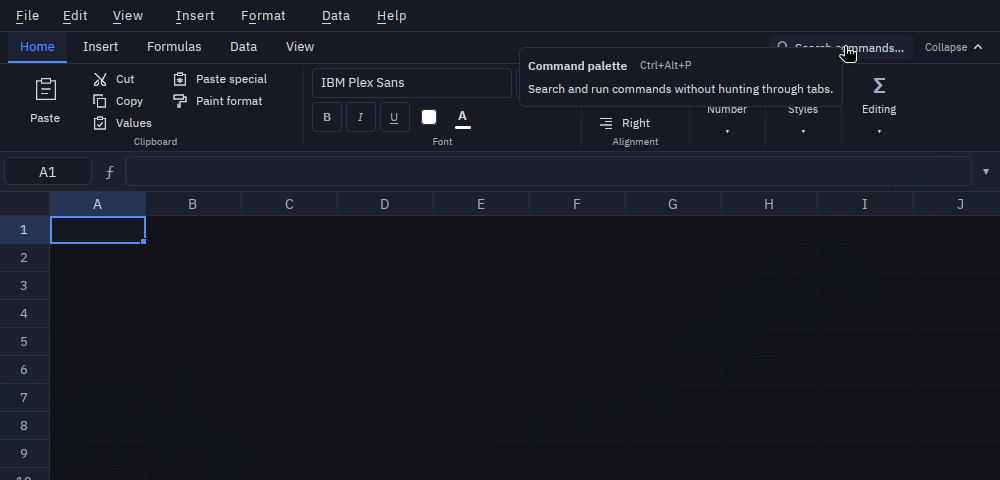
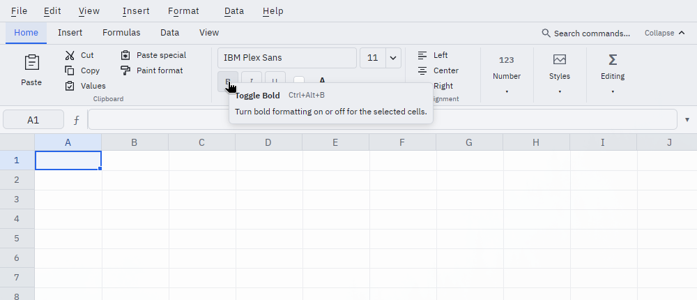

# Native toolbar and ribbon

This branch starts Phase 1 of the Obsidian **VisiGrid Toolbar and Ribbon Spec**.
It is an opt-in native UI implementation, not a release of the complete spec.

## Try it

- **View → Toolbar: Ribbon**, or **Preferences → Appearance → Toolbar layout**.
- The command palette also has **Use Ribbon Toolbar**, **Use Compact Toolbar**,
  **Collapse/Expand Ribbon**, and **Show/Hide Toolbar**.
- Home, Insert, Formulas, Data, and View group existing commands. Home reuses
  the existing font picker, font-size editor, color controls, and mixed formatting states.
- Collapse keeps the tabs visible. Selecting a tab opens a temporary panel;
  Escape or clicking outside dismisses it. Double-clicking a tab toggles collapse.
- Reduced widths collapse groups into menus without adding rows of chrome.
- **Search commands…** in the tab strip opens the existing command palette,
  including while the ribbon is collapsed. Opening it preserves a cell-edit
  draft; Escape returns to that draft.
- Compact remains the default. An existing hidden format bar remains hidden;
  choosing Ribbon does not implicitly turn it on.

No account is required and no workbook format changes are involved. Changing
the layout is a personal preference, not a document edit or undo operation.

## Ribbon design pass

The ribbon keeps its 32-pixel tab strip and 88-pixel command body. Tabs use a
stronger type hierarchy; group captions are centered below the controls and
separators are subdued. Paste is a larger primary control, while other commands
pair a small native vector icon with a text label. Icons inherit the theme and
disabled colors. Font controls continue to use the shared Compact components, with a wider
font-family picker in Ribbon.

Command icons reserve a fixed slot that becomes the KeyTip badge when Alt hints
are visible, so toggling hints does not move or shorten the labels. Command
codes and dispatch are unchanged. Wider groups make labels more readable;
narrow windows collapse whole groups earlier instead of shrinking their text.
Overflow controls include an icon, group name, and chevron, and their popovers
repeat the group name as a heading.

Command tooltips explain the action, show its effective shortcut from the live
keymap (including user overrides), and explain why it is disabled. Commands
without a matching shortcut omit that label. Shared font controls use the same
rich help in Ribbon; Compact retains its existing tooltips.

At the 1000-pixel minimum width, with test shortcut overrides:





## Alt KeyTips (Linux and Windows)

With the visible Ribbon selected and the sheet in navigation mode, tap and
release **Alt** by itself to show hints. Existing menu letters stay
**F** File, **E** Edit, **V** View, **I** Insert, **O** Format, **D** Data,
**H** Help. In Ribbon, the tab hints are **B** Home, **N** Insert,
**M** Formulas, **A** Data, **W** View. Alt-tap hints are disabled in Compact,
while editing cells or formulas, and when the toolbar is hidden (including Zen).

After selecting a ribbon tab, type the group letter and command number shown
on the control. For example, **Alt, B, F, 2** toggles Bold; **Alt, B, F, 6**
opens the font-size editor. These are sequential presses, not function keys.
A collapsed group opens when its letter is typed, revealing the command hints.
Disabled commands keep their existing guards and explain the reason in the
status bar. They leave hints open so another command can be selected.

Escape/Backspace clears a partial command, then returns to the root hints,
then dismisses them. Alt again dismisses them. Hints do not expire on a timer.
A mouse click or window deactivation dismisses hints. A chord using Alt does
not activate hints when Alt is released; existing Alt shortcuts still use the
normal keymap. Hints do not take over dialogs, terminal/script input, IME
composition, or toolbar text fields. An Alt tap during typing leaves subsequent
letters in the editor; cell-changing ribbon commands remain disabled during editing.

**macOS is deferred:** its existing Option+Space/category behavior is unchanged.
The new Alt-tap binding and key interceptor are excluded from macOS builds.
Native menu placement, Option composition, font rendering and window scaling
must be reviewed on a Mac before deciding the Mac interaction.

Known pre-existing binding overlaps are separate follow-ups: held
`Alt+H, C, P` shares the Help prefix; `Alt+Enter` has both newline and trace
return registrations; opted-in Mac `Alt+T` overlaps Tools and Trace. This change
preserves those bindings. In the new tap-Alt hints, H opens Help immediately.
F10 remains Problems / debugger Step Over; Ctrl+F1 is not newly assigned.

## Implementation

`toolbar.rs` owns command-surface geometry and preference actions. The formula
bar is below the command groups in Ribbon and above the format bar in Compact.
The grid's origin, formula-bar hit testing, script editor's available height,
format dropdowns, and formula help placement share these coordinates. Normal
chrome remains hidden in Zen; Table controls and recovery banners keep their
existing behavior.

`views/ribbon.rs` describes tabs/groups and dispatches existing `CommandId`
operations. Ribbon Insert rows/columns inserts at the selection's top row or
left column, one line per selected row or column. Whole-line selections retain
their span; requesting the other axis inserts one line at the active cell.
Additional selections are rejected. These commands use the existing structural
edit and undo paths. Ctrl+= retains its whole-row/column selection requirement.
Commands that require cell navigation stay disabled
during an active edit or modal; changing layout itself does not commit or
discard a cell edit. The Font group keeps its real controls visible and dimmed
under a blocking cover during an edit or modal. Read-only restrictions are
rechecked on invocation.

`appearance.toolbar` stores `schema_version`, `layout`, and
`ribbon_collapsed` in the user settings. Unknown fields are retained. Malformed
toolbar fields resolve independently, so they do not reset unrelated settings.
Future schemas are preserved and are not overwritten by the layout controls.
`appearance.show_format_bar` remains the visibility flag for compatibility.
Toolbar changes use the shared settings store and report save failures; user
settings saves now write a temporary file and rename it over the destination.
Existing settings-file symlinks are followed so the target is updated atomically
and the link survives. Broken links report a save error without replacing the link.

No keyboard shortcuts are reassigned. The new actions can be bound through
`view.compacttoolbar`, `view.ribbontoolbar`, `view.collapseribbon`, and
`view.toolbar` in the user keybindings file.

## Remaining work before calling Phase 1 complete

- Complete native interaction QA, including focus transfer, cell/formula edits,
  IME input, mixed formatting, dropdown handoff, multiple windows, and scaling.
- Validate keyboard entry into the ribbon and the complete focus order. Match
  the specified tab-strip arrow behavior and every picker's keyboard support.
- Consolidate toolbar command metadata across surfaces; finish context-specific
  availability for commands such as pivot refresh. Ribbon tooltip shortcuts now
  resolve from the live keymap; other command surfaces are a separate follow-up.
- Convert the flat View entries to the specified checked Toolbar submenu.
- Replace Compact's existing horizontal scrolling with group overflow.
- Anchor every popup to measured control bounds, including controls opened
  from an overflow menu; finish viewport-edge clamping.
- Complete macOS and Windows interactive validation and broader Linux native QA.
- Validate the concept with the original commenter before expanding scope.

Quick access pinning/reordering and advanced custom tabs/groups are later
phases. This branch does not expose placeholder customization controls.

## Validation

On Linux, `cargo check` and the desktop build pass. The desktop unit suite passes
with **628 passed, 0 failed, 3 ignored**. It caught and fixed a duplicate View
accelerator and a default preference serialization regression.

Linux/Wayland smoke checks at 1920×1200, scale 1: Home/Data tab rendering,
collapse and temporary expansion, palette switching in both directions,
preservation of an active cell draft when switching to Ribbon, cancelling that
draft, and the reused Bold control. These are targeted checks, not the full
acceptance matrix above. Additional Linux KeyTips checks cover Alt tap, root/tab command hints, H → Help,
Bold dispatch, the collapsed font-size editor, held Alt+F without stray hints,
and a 941-pixel tiled window revealing the
Editing overflow group and opening Find through its KeyTip. Windows runtime and the separate macOS keyboard design remain open.
A screenshot is saved alongside the workspace concept
at `work/visigrid-toolbar/native-ribbon.png` (outside this repository).

The design pass was checked in Ledger Dark and Ledger Light on Linux at scale
1, including Home and Data command labels, Alt hints without label movement,
and the 941-pixel Editing overflow panel with Find invoked by its KeyTip.
Review captures are in `work/visigrid-toolbar/native-ribbon-design-*.png` outside
this repository. Other display scales still need native review.

PR #81 follow-up at `45c4cfa`:

- The Mac review reports successful Apple Silicon release-build checks in both
  themes across all tabs, collapse/flyout, 1000-point overflow, layout switching,
  Font controls under the Conditional Format editor, insertion from D5, and
  status messages. Its screenshots are embedded in PR #81. Mac KeyTips remain
  deferred.
- The Linux desktop build and full 625-test suite pass. Native checks at
  2560×1440, scale 1 confirm readable Home KeyTips after the column-spacing
  change, disabled Font controls preserving a cell-edit draft on clicks,
  insertion of a row at D5 and a column at A4 through KeyTips, undo for both,
  and the 1000-pixel Editing overflow menu invoking Find through its KeyTip.
  These checks supplement, rather than complete, the acceptance matrix above.

Final Linux polish checks at 2560×1440, scale 1, with a 1000×900 window:

- Search opens the palette in expanded and collapsed Ribbon. Searching and
  running a layout/theme command works; Escape restores an unfinished cell edit.
- Alt-tap leaves the next letter intact in Compact, cell edits, and formula
  edits. Ribbon navigation still shows Home command hints and dispatches Bold.
- Rich help is readable in Ledger Light and Ledger Dark. Palette, Bold, and
  Paste Values tooltips show configured shortcut overrides; the shadowed Bold
  default is not shown. Disabled Paste Special explains the active-edit guard.
- The desktop build and all 628 tests pass. These final controls still need a
  fresh Mac/Windows native check; the earlier Mac review predates this polish.

Settings tests cover legacy defaults, hidden-toolbar migration, malformed
fields, round trips, future-schema retention, atomic save, symlink preservation,
and write failure. KeyTip scope tests cover navigation, cell/formula editing,
dialogs, Compact, and hidden Ribbon.
Geometry tests cover both platform chrome heights, expanded formula bars,
Compact, expanded/collapsed Ribbon, hidden toolbar, and Zen. Group-layout tests
cover fixed-height overflow. Existing menu model tests validate mouse and
keyboard command order together.

Run from the workspace root:

```sh
cargo check -p visigrid-gpui --bin visigrid
cargo test -p visigrid-gpui --bin visigrid
```

Build and run a separate binary/configuration for visual review; avoid changing
the user's normal settings or opening production workbooks during QA.
